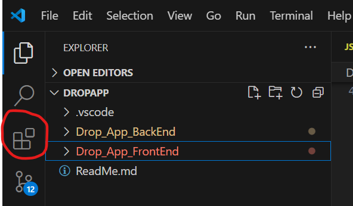

# Project Overview

This project is a full-stack mobile and web application designed to support item sharing and donation within a university community. The platform enables users to post items, search through listings, communicate via chat, and participate in a coin-based economy that incentivizes sharing and responsible behavior.

The application is built with a Flutter frontend and a JavaScript-based backend, connected through RESTful APIs. During development, a local SQLite database was used to facilitate rapid iteration, with a later transition to an online database to support scalability and real-world deployment. The system emphasizes usability, social interaction, and trust through features such as filtering, reputation ratings, and a transparent coin assignment mechanism.

# Frontend

The lib folder contains api, components, models, pages, tabs and top_bar. 

### API

The api file provides the frontend api for connecting with the backend which includes many functions among which are fetching and inserting api functions. 

### Models

The models which provide a class for the fetched data from the  database can be found in the models folder. 

### Components

In order to ensure reusability of code and easy use of widgets, we have created the files in the components folder. 

### Pages

The main tabs can be found in the tabs folder whereas pages that are obtained by navigating through a tab are present in the pages folder.  

### Top_bar

The top_bar file contains the code for the top bar which will contain the filter sandwich button, the search bar and the number of coins a user has.

# Backend

The backend of the application is divided into four main sections: **Database**, **Models**, **DAO Functions**, and **APIs**.

### **Database**

We decided for a local SQLite database during development to avoid the restrictions of an online solution like Firebase, like daily interaction limits. This implies that the changes are only visible locally, so for the final version of the app, we plan to transition to an online database to support scalability and real-world usage.

UPDATE: a new branch of the project (’online-db’), contains the edited functions and the connection with a free online db.

### Models

Models are used to define the data structures within the application, representing each table in the database. These models act as the blueprint for organizing and validating the data.

### **DAO Functions**

DAO functions allow communication between the application and the database. They include MySQL queries for interacting with the database and JavaScript code to handle promises and manage asynchronous operations. Additional functions have been implemented assigne the initial coins to new users and calculating coin values for products.

### **APIs (index.mjs)**

APIs are responsible for enabling data exchange between the frontend and backend. These functions are organized into distinct categories, corresponding to the tables in the database.

The login system is currently a simplified version, but both the database and backend code are prepared for an upgrade to a more secure structure using libraries like Passport and LocalStrategy.

# Considerations and Future Improvements

Thanks to insights from our user study, we made several improvements to the application's usability:

- Filters are now left unchecked by default based on user interaction observations. A issue that is the process of fixing is the persistence of the filters selection.
- Location information is included.
- A "Loading" indicator enhances user understanding.

Other features we aim to consider for future implementation are:

- Tutorial dialog boxes guide users through the app, to better familiarize the users.
- The login system  using libraries like Passport and LocalStrategy.
- A user profile page allows users to track answered posts.
- Users can now delete or modify their posts.

# Instructions

### Github

1. Open the Github page of the project and copy the link. 
    
    
    
2. Create a new folder into your computer. Open the folder, press the right button of your mouse and press “Open Git Bash”.
    
    
    
3. In the terminal write the following:

```jsx
git clone <repository-url>
```

If git is not installed in your computer, you can download the zipped folder directly from the Github page.

### VSCode

1. Open a project and open the “Extensions” section of VScode.
    
    
    
2. Type “Flutter”, open the first result and install it.
    
    
    

1. VSCode will display an alert about the missing SDK. Click 'Download.' ATTENTION: Be sure to remember the folder where you are downloading Flutter. It will be useful for the next step.
    
    
    
2. Open the System Variable and add the path of the flutter/bin folder to the Path section.
    
    
    
3. Open a second terminal in VSCode and execute the following commands:

```jsx
cd frontend
flutter run -d chrome --web-browser-flag "--disable-web-security"
```

# Libraries and Frameworks

Libraries used for similarity search within products file:

```jsx
import { readFileSync } from 'fs';
import pkg from 'natural';
const { PorterStemmer } = pkg; 
import { compareTwoStrings } from 'string-similarity'; 
```

Libraries used respectively for APIs management, Cross Origin interaction, Session and Login:

```jsx
import express from 'express';
import morgan from 'morgan';
import { check, validationResult } from 'express-validator';
import cors from 'cors';

/** Authentication-related imports **/
import passport from 'passport';
import LocalStrategy from 'passport-local';
import crypto from "crypto";

/** Creating the session */
import session from 'express-session';
```

The login and sign-up form in the frontend are also created following layouts available on the internet and the adapted to our application.

Libraries used respectively for APIs dart conversion, page structure and dates handling:

```dart
import 'dart:convert';
import 'package:http/http.dart' as http;

import 'package:flutter/material.dart';
import 'package:intl/intl.dart';
```

AI chatbots, like ChatGPT and Copilot,  have been used to handle debugging of the code and the generation of the products file.
